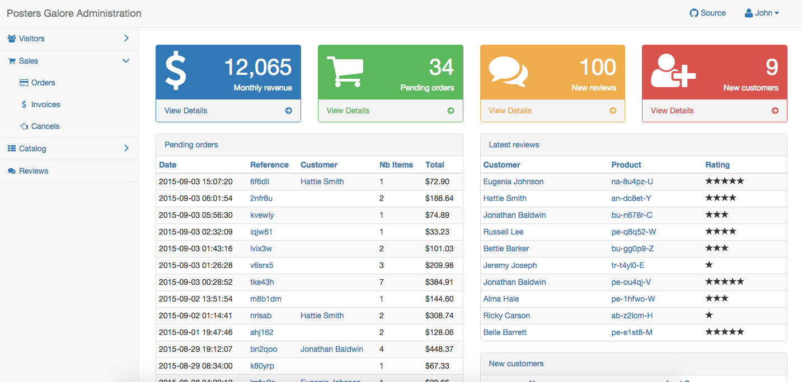

# ng-admin demo configuration

This is a demo of the [ng-admin](https://github.com/marmelab/ng-admin) module for Angular.js. It creates a working administration for a fake poster shop named **Posters Galore**. You can test it online at [http://marmelab.com/ng-admin-demo](http://marmelab.com/ng-admin-demo).

[](http://marmelab.com/ng-admin-demo)

ng-admin usually requires a REST server to provide data. In this demo however, the REST server is simulated by the browser (using [FakeRest](https://github.com/marmelab/FakeRest)). You can see the source data in [data.js](https://github.com/marmelab/ng-admin-demo/blob/master/data.js).

To explore the source code, start with [js/main.js](https://github.com/marmelab/ng-admin-demo/blob/master/js/main.js).

## Installation

No installation needed to play with the demo. Just clone the repo, and open the `index.html` file.

## Generating a new Dataset

The dataset is generated randomly. You can generate a new dataset with:

```sh
# update the data.js file
make data
```

To modify the data generator, start with [dataGenerator/generate.js](https://github.com/marmelab/ng-admin-demo/blob/master/dataGenerator/generate.js).

## Tweaking The Admin

If you want to modify the admin configuration and see how it affects the admin, you'll need to install the build tools.

```sh
## install npm dependencies
make install
## run the server
make run
```

You can now open `http://localhost:8080/webpack-dev-server/`. Every change in the source will reload the page in the browser.

## Pushing an update

You'll need to build the minified source before releasing a new version.

```sh
# update the files under build/
make build
```

## License

ng-admin-demo is licensed under the [MIT Licence](LICENSE), and sponsored by [marmelab](http://marmelab.com).
